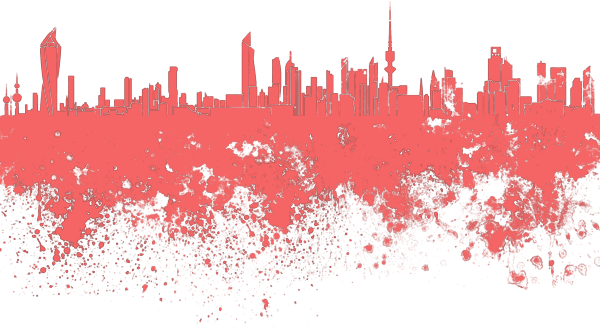

<table class="w-full text-left table-collapse mb-0">
    <thead>
    <tr>
    <th class="text-sm font-semibold text-gray-700 p-2 bg-gray-100">Class</th>
    <th colspan="2" class="text-sm font-semibold text-gray-700 p-2 bg-gray-100">Properties</th>
    </tr>
    </thead>
    <tbody class="align-baseline">
    
        <tr>
        <td class="p-2 border-t border-gray-300 font-mono text-xs text-purple-700 whitespace-no-wrap">t.{{ page.classes.name }}{{ value[0] }}</td>
        <td class="p-2 border-t border-gray-300 font-mono text-xs text-blue-700 whitespace-pre">{{ page.classes.key }}: {{ value[1] }}</td>
        
        
            <td class="w-24 p-2 font-mono text-xs text-blue-700 whitespace-pre" style="background-image: url('https://tailwindcss.com/img/transparent-bg.svg');"></td>
        
            <td class="w-24 p-2 font-mono text-xs text-blue-700 whitespace-pre" style="background-color: {{ colorValue }}"></td>
        
        </tr>
    
    </tbody>
</table>

## Usage

Changes the color of all the non-transparent pixels to the <code class="language-plaintext">ttint{Color}</code>.

without tint color

with tint color

